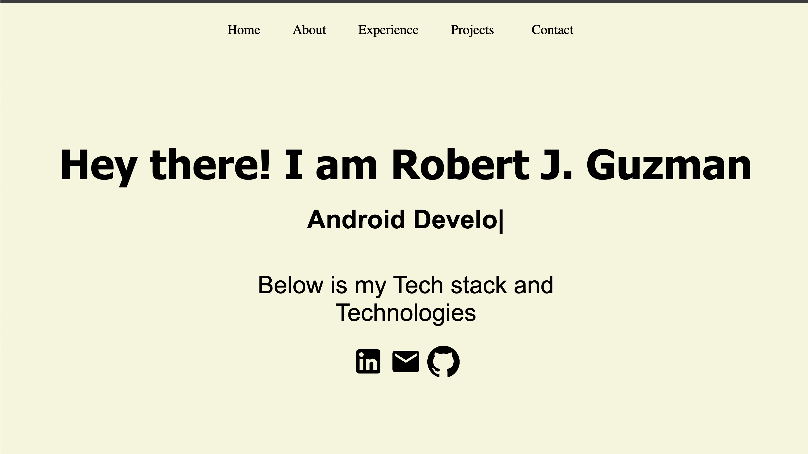

# Portfolio Website ‼️

This portfolio website, built using React, showcases my personal and professional projects, highlighting my skills and accomplishments in software development. Designed with React's component-based architecture, the site offers a dynamic and interactive user experience, allowing visitors to easily navigate through my work. The use of modern web technologies and responsive design ensures that the website is accessible and visually appealing across all devices. Through this portfolio, I aim to provide a comprehensive overview of my capabilities, including coding projects, technical expertise, and creative endeavors, all hosted on GitHub for transparency and collaboration. Whether you're a potential employer, a fellow developer, or simply interested in my work, this portfolio is a reflection of my passion for technology and my commitment to excellence in the digital realm.

## Portfolio

## Tech Stack 💻

**Client:** React, Yarn, Material UI, Icons
